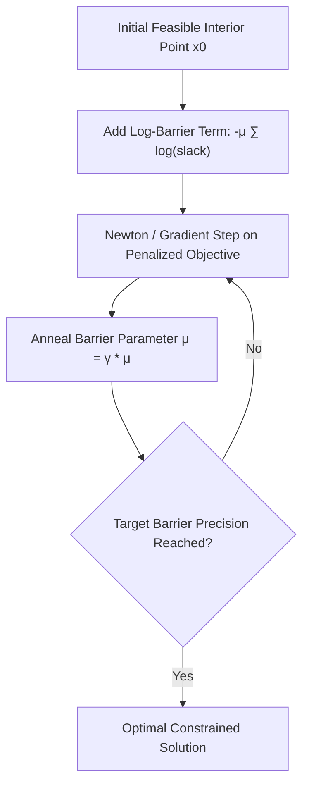

# Logarithmic Barrier Interior-Point Skill

Interior-point algorithm tracing the central path for inequality-constrained convex optimization problems.

## Features
- **100% Python Standard Library**: Pure standard library functions.
- **Central Path Tracing**: Strictly stays within the interior of the feasible set.
- **Penalty Annealing**: Smooth convergence to active boundary faces.
